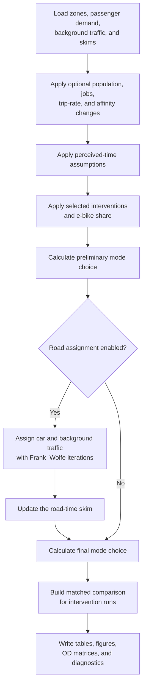

# ⚠️ Transport Model Engine (Backend Reference)

> [!NOTE]
> **Read-Only Backend Directory:** This folder contains the underlying Four-Step Transport Model (FSM) engine for Canton Zürich. 
> You **do not** need to run, debug, or modify these scripts directly for your coursework.
> 
> All simulation runs, intervention definitions, and policy evaluations are handled via the notebooks in `notebooks/` and the configuration files in `code/` (`parameters.py`, `stages.py`, `pathways.py`).
>
> For the student simulation guide and workflow, see [`code/README.md`](../code/README.md).

---

# Canton Zürich Transport Model (FSM)

This directory contains a standalone afternoon-peak transport model for Canton Zürich. It includes the Python model, prepared runtime inputs, and the public raw datasets required to rebuild those inputs.

The model represents **1,223 NPVM zones** and combines passenger demand, multimodal travel-time skims, discrete mode choice, infrastructure interventions, and optional road traffic assignment.


## Contents

1. [Architecture and execution flow](#architecture-and-execution-flow)
2. [Zoning, demand, and networks](#zoning-demand-and-networks)
3. [Intervention mechanics](#intervention-mechanics)
4. [Input data](#input-data)
5. [Rebuilding inputs (optional)](#rebuilding-inputs-optional)
6. [Outputs](#outputs)
7. [Code map](#code-map)

## Architecture and execution flow



When invoked through `transport_model_interface.py`, the model executes the following sequence:

1. Load the prepared NPVM zones, passenger demand, fixed road-background demand, and multimodal skims.
2. Optionally modify population, employment, trip rates, mode affinities, and e-bike share.
3. Apply perceived connector, terminal, intrazonal, and public-transport floor assumptions.
4. Apply the selected infrastructure interventions to the travel-time and distance skims.
5. Allocate passenger demand across car, bicycle, walking, PT with walking access, and PT with bicycle access using multinomial logit choice.
6. If assignment is enabled, assign car demand and fixed background traffic to the road network using the Method of Successive Averages (MSA) or Frank–Wolfe iterations.
7. Recalculate mode choice using the assigned congested road-time skim.
8. Return multimodal trip matrices and aggregate corridor indicators to the simulation engine.

## Zoning, demand, and networks

### Zoning and demand
- The model uses **1,223 NPVM zones** within Canton Zürich.
- Zones in the City of Zürich are labelled `Quartier`; the remaining zones are labelled `Canton`.
- Zone attributes include municipality and City-quarter names, making spatial interventions readable without long lists of zone IDs.
- Population is sourced from STATPOP 2024 and employment from STATENT 2023.
- Passenger demand represents the **17:00–18:00 afternoon peak** and combines NPVM car, PT, walking, bicycle, and e-bike matrices.
- Freight and commercial traffic are included as fixed road-background demand that consumes road capacity.
- Peripheral NPVM zones are represented through gateway mappings.

### Networks, skims, and mode choice
Road, walking, and bicycle skims use frozen OpenStreetMap-derived network snapshots. Public-transport skims are based on a representative weekday in the 17:00–18:00 period (GTFS).

The PT skims retain:
- in-vehicle time (IVT);
- access and egress time;
- initial and transfer waiting time;
- physical transfer time;
- transfer count;
- selected origin and destination stops; and
- mode-specific distance.

Walking is available for reachable trips of up to 5 km. Bicycle speed is 13 km/h in the base model. E-bikes reduce standalone bicycle time and bicycle access/egress time for PT, but do not change PT waiting, transfer, or in-vehicle time.

Mode choice is implemented in [`mode_choice_zurich.py`](mode_choice_zurich.py), using calibrated coefficients from [`config/mode_choice.json`](config/mode_choice.json).

## Intervention mechanics

In the course pipeline, infrastructure stages are defined in [`code/stages.py`](../code/stages.py). When a stage is evaluated, its specifications are translated into skim modifications by [`interventions.py`](interventions.py).

The engine supports four primary intervention types:

| Intervention type | Target network | Supported effects |
|---|---|---|
| `railway_expansions` | Public transport OD pairs | In-vehicle time reduction, initial wait reduction, transfer wait reduction, speed increase |
| `mobility_hubs` | Station nodes and surrounding zones | Station access time, egress time, physical transfer walking time |
| `road_capacity` | Highway and road links | Free-flow speed increase, travel time reduction |
| `bike_highways` | Cycling paths between area pairs | Distance reduction, cycling speed increase |

### Spatial targeting and scaling
- Interventions target geography using either corridor link pairs (`area_pairs`) or localized station zones (`zones`).
- **Percentage reductions:** For a time reduction of $r\%$, the affected skim values are multiplied by $(1 - r/100)$.
- **Speed increases:** For a speed increase of $s\%$, travel times are multiplied by $1 / (1 + s/100)$.

## Input data

### Prepared runtime inputs
All regular model runs use the five validated files in `input_data/prepared/`:

| File | Contents |
|---|---|
| `zones.parquet` | Zone geometry, spatial names, City/Canton level, population, and jobs |
| `demand.pkl.gz` | Passenger OD and fixed road-background OD tables |
| `skims.pkl.gz` | Direct-mode and PT-component time, distance, and selected-stop matrices |
| `lookups.pkl.gz` | Zone-to-stop lookup tables used by mobility-hub interventions |
| `assignment_network.pkl` | Road network, capacities, and zone-to-node mappings |

The compressed pickle packages contain dictionaries of pandas DataFrames. The supplied prepared inputs are sufficient for all normal runs, assignment methods, and stage interventions.

### Input directories
```text
input_data/
├── raw/       Public source archives and frozen OSM network snapshots
├── prepared/  Validated runtime packages used by the transport model
└── work/      Disposable intermediate files used during rebuilding
```

The model reads exclusively from `prepared/`; it never modifies raw source files.

## Rebuilding inputs (optional)

Rebuilding is an optional, computationally intensive maintenance task (particularly for GTFS and full-Canton walking networks). Students do not need to rebuild inputs.

To verify the supplied runtime files:
```bash
python prepare_inputs.py --check-runtime
```

If an explicit rebuild is required:
```bash
python prepare_inputs.py --all
```

## Outputs

When executed, model runs write output metrics, tables, and diagnostics to `outputs/` (or directly return them in memory to `transport_model_interface.py`):

| Output | Purpose |
|---|---|
| `mode_summary.csv` | Four-mode trips, shares, passenger-kilometres, and mean distance |
| `mode_summary_detailed.csv` | Detailed results with `pt_walk` and `pt_bike` separated |
| `mode_summary_by_area*.csv` | Results for the full model, City origins, and other Canton origins |
| `mode_share_by_distance_bin*.csv` | Mode shares by distance band and origin area |
| `modal_share_pies.png` | Trip-share and passenger-kilometre-share charts |
| `od_<mode>.parquet` | Final OD trips assigned to each mode-choice alternative |
| `zone_accessibility.parquet` | Final logsum accessibility by zone |
| `road_link_flows.parquet` | Assigned road-link flows when assignment is enabled |
| `intervention_summary.csv` | Selected interventions compared with a matched no-intervention case |
| `run_metadata.json` | Effective run settings for reproducibility |
| `diagnostics.json` | Model and road-assignment diagnostics |

## Code map

| File or directory | Responsibility |
|---|---|
| [`Main.py`](Main.py) | Standalone CLI entry point and execution sequence |
| [`config.py`](config.py) | Repository paths and core modelling assumptions |
| [`config/mode_choice.json`](config/mode_choice.json) | Mode-choice coefficients and monetary assumptions |
| [`zoning.py`](zoning.py) | NPVM zoning and runtime-input loading |
| [`demand_preparation.py`](demand_preparation.py) | Raw NPVM demand aggregation |
| [`background_traffic.py`](background_traffic.py) | Peripheral and commercial road-background demand |
| [`network.py`](network.py) | Direct networks, skims, and assignment network |
| [`routing.py`](routing.py) | Shortest-path helper used during preprocessing |
| [`gtfs_analysis.py`](gtfs_analysis.py) | GTFS processing and PT-component skims |
| [`scenario_generation.py`](scenario_generation.py) | Population, employment, and trip-demand scenarios |
| [`mode_choice_zurich.py`](mode_choice_zurich.py) | Mode utilities and probabilistic mode choice |
| [`interventions.py`](interventions.py) | Editable infrastructure interventions and intensity levels |
| [`travel_times.py`](travel_times.py) | Skim loading and perceived-time policies |
| [`trip_assignment_zurich.py`](trip_assignment_zurich.py) | Road traffic assignment using `ta_lab` |
| [`model_outputs.py`](model_outputs.py) | Output tables, figures, and file writing |
| [`input_packages.py`](input_packages.py) | Prepared-package reading, writing, and alignment |
| [`prepare_inputs.py`](prepare_inputs.py) | Raw-to-prepared preprocessing workflow |
| `ta_lab/` | Frank–Wolfe traffic-assignment library |
