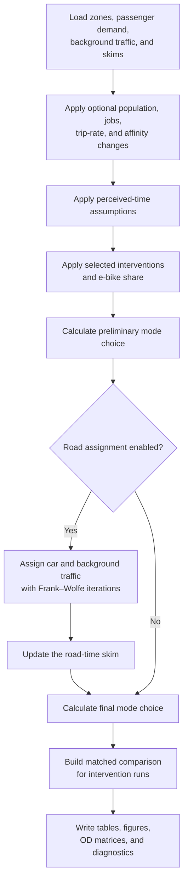

# ⚠️ Transport Model Engine (Read-Only / Backend)
> **Note:** This directory contains the underlying Four-Step Transport Model (FSM) engine. 
> You **do not** need to edit, debug, or understand these files in detail for your coursework. 
> All student interactions occur via `code/` and the notebooks in `notebooks/`.


# IP Course FSM — Canton Zürich Transport Model

This directory contains a standalone afternoon-peak transport model for Canton Zürich. It includes the Python model, prepared runtime inputs, and the public raw datasets required to rebuild those inputs.

The model represents **1,223 NPVM zones** and combines passenger demand, multimodal travel-time skims, mode choice, infrastructure interventions, and optional road assignment.

> The prepared inputs are used to run the model. Rebuilding inputs from raw data is a separate, explicit workflow and is never started automatically.

For the MehrSpur course workflow and the connection to the 40-year pathway model, see [`code/README.md`](../code/README.md).

## Contents

1. [Getting started](#getting-started)
2. [How the model works](#how-the-model-works)
3. [Model settings and interventions](#model-settings-and-interventions)
4. [Input data](#input-data)
5. [Rebuilding the inputs](#rebuilding-the-inputs)
6. [Outputs](#outputs)
7. [Code map](#code-map)

## Getting started

### 1. Create the environment

From this directory, run:

```bash
conda env create -f environment.yml
conda activate ip-course-fsm
```

### 2. Check the supplied runtime inputs

```bash
python prepare_inputs.py --check-runtime
```

The check verifies the five required files in `input_data/prepared/`. If a required file is missing or invalid, the model stops with an input error.

### 3. Configure and run the model

Edit the **Run settings** block near the top of [`Main.py`](Main.py), then run:

```bash
python Main.py
```

Road assignment is enabled by default. For a faster run with prepared free-flow road times:

```bash
python Main.py --no-assignment
```

Normal runs create timestamped folders under `outputs/`. To use a specific output directory:

```bash
python Main.py --output-dir outputs/my_scenario
```

## How the model works



The sequence is implemented in [`Main.py`](Main.py). In summary:

1. Load the prepared NPVM zones, passenger demand, fixed road-background demand, and multimodal skims.
2. Optionally modify population, employment, trip rates, mode affinities, and e-bike share.
3. Apply perceived connector, terminal, intrazonal, and public-transport floor assumptions.
4. Apply the selected infrastructure interventions.
5. Allocate passenger demand across car, bicycle, walking, PT with walking access, and PT with bicycle access.
6. If enabled, assign car demand and fixed background traffic to the road network.
7. Recalculate mode choice with the assigned road-time skim.
8. Save model results and diagnostics.

Road assignment uses one outer pass: preliminary mode choice → road assignment → final mode choice. It is not repeated until mode choice converges.

### Zoning and demand

- The model uses 1,223 NPVM zones within Canton Zürich.
- Zones in the City of Zürich are labelled `Quartier`; the remaining zones are labelled `Canton`.
- Zone attributes include municipality and City-quarter names, making spatial interventions readable without long lists of zone IDs.
- Population comes from STATPOP 2024 and employment from STATENT 2023.
- Passenger demand represents the 17:00–18:00 afternoon peak and combines NPVM car, PT, walking, bicycle, and e-bike matrices.
- Freight and commercial traffic are included as fixed road-background demand.
- Peripheral NPVM zones are represented through gateway mappings.

### Networks, skims, and mode choice

Road, walking, and bicycle skims use frozen OpenStreetMap-derived network snapshots. Public-transport skims are based on a representative weekday in the 17:00–18:00 period.

The PT skims retain:

- in-vehicle time;
- access and egress time;
- initial and transfer waiting time;
- physical transfer time;
- transfer count;
- selected origin and destination stops; and
- mode-specific distance.

Walking is available for reachable trips of up to 5 km. Bicycle speed is 13 km/h in the base model. E-bikes reduce standalone bicycle time and bicycle access/egress time for PT, but do not change PT waiting, transfer, or in-vehicle time.

Mode choice is implemented in [`mode_choice_zurich.py`](mode_choice_zurich.py), using coefficients from [`config/mode_choice.json`](config/mode_choice.json).

## Model settings and interventions

### Run settings

Students normally edit the settings near the top of [`Main.py`](Main.py).

| Setting | Purpose |
|---|---|
| `RUN_NAME` | Short label used in the output-folder name |
| `RUN_ASSIGNMENT` | Enables road assignment; `--no-assignment` overrides it for a quick run |
| `APPLY_SCENARIO` | Selects baseline demand or applies `SCENARIO_SETTINGS` |
| `SCENARIO_SETTINGS` | Controls population, jobs, trip rate, mode affinities, and e-bike share |
| `INTERVENTION_SELECTION` | Selects level 0, 1, or 2 independently for each intervention type |

Population and job multipliers set totals relative to the baseline; they do not represent a specific calendar year. City growth shares distribute net change between the City of Zürich and the rest of the Canton. Positive affinity values multiply mode-choice odds, where `1.0` means no change.

There are no separate scenario or intervention JSON files:

- scenario controls and intervention selections are in [`Main.py`](Main.py);
- demand mechanics are in [`scenario_generation.py`](scenario_generation.py);
- intervention definitions and effects are in [`interventions.py`](interventions.py);
- mode-choice coefficients are in [`config/mode_choice.json`](config/mode_choice.json).

### Available interventions

The three intervention types can be selected independently and combined.

| Intervention | Location | Level 1 | Level 2 |
|---|---|---|---|
| Bike highway | Altstetten–Schlieren–Dietikon OD pairs, for bicycle paths of 2–15 km | Cycling speed +20% | Cycling speed +35% |
| Railway expansion | City of Zürich–Winterthur OD pairs | PT in-vehicle time −8%, initial wait −20%, transfer wait −10% | PT in-vehicle time −15%, initial wait −40%, transfer wait −25% |
| Mobility hub | Paths using Forch station as selected origin or destination stop | Access/egress −10%, physical transfer −20%, transfer wait −10% | Access/egress −25%, physical transfer −40%, transfer wait −25%, initial wait −15% |

Bike and railway interventions use readable zone attributes such as `city_quartier`, `municipality_name`, and `Level`. Mobility hubs use explicit GTFS stop IDs and retain the baseline selected stop; they do not reroute passengers to a different station.

Supported effects include changes to travel time, distance, speed, initial wait, transfer wait, physical transfer, access, and egress time.

## Input data

### Prepared runtime inputs

Every normal model run uses the five files in `input_data/prepared/`:

| File | Contents |
|---|---|
| `zones.parquet` | Zone geometry, spatial names, City/Canton level, population, and jobs |
| `demand.pkl.gz` | Passenger OD and fixed road-background OD tables |
| `skims.pkl.gz` | Direct-mode and PT-component time, distance, and selected-stop matrices |
| `lookups.pkl.gz` | Zone-to-stop lookup tables used by mobility-hub interventions |
| `assignment_network.pkl` | Road network, capacities, and zone-to-node mappings |

The compressed pickle packages contain dictionaries of pandas DataFrames. The supplied prepared inputs are sufficient for normal runs, assignment, and both levels of all three interventions.

### Input directories

```text
input_data/
├── raw/       Public source archives and frozen OSM network snapshots
├── prepared/  Validated runtime packages used by Main.py
└── work/      Disposable intermediate files used during rebuilding
```

`Main.py` reads the prepared files; it does not launch preprocessing or write to `input_data/`. Raw source files are never deleted. After a successful rebuild, intermediate files are removed unless `--keep-work` is supplied.

## Rebuilding the inputs

Rebuilding is optional and computationally intensive, particularly for GTFS and full-Canton walking-network processing.

Check the prepared runtime packages:

```bash
python prepare_inputs.py --check-runtime
```

Check all raw sources:

```bash
python prepare_inputs.py --check-raw
```

Rebuild everything:

```bash
python prepare_inputs.py --all
```

Individual stages are also available:

```bash
python prepare_inputs.py --zones-demand
python prepare_inputs.py --networks
python prepare_inputs.py --gtfs
```

Package compatible intermediate files already present in `input_data/work/`:

```bash
python prepare_inputs.py --package
```

Add `--keep-work` when intermediate tables are needed for teaching or diagnostics.

## Outputs

Each run writes a timestamped output directory unless `--output-dir` is supplied.

| Output | Purpose |
|---|---|
| `mode_summary.csv` | Four-mode trips, shares, passenger-kilometres, and mean distance |
| `mode_summary_detailed.csv` | Detailed results with `pt_walk` and `pt_bike` separated |
| `mode_summary_by_area*.csv` | Results for the full model, City origins, and other Canton origins |
| `mode_share_by_distance_bin*.csv` | Mode shares by distance band and origin area |
| `modal_share_pies.png` | Trip-share and passenger-kilometre-share charts |
| `od_<mode>.parquet` | Final OD trips assigned to each mode-choice alternative |
| `zone_accessibility.parquet` | Final logsum accessibility by zone |
| `road_link_flows.parquet` | Assigned road-link flows when assignment is enabled |
| `intervention_summary.csv` | Selected interventions compared with a matched no-intervention case |
| `run_metadata.json` | Effective run settings for reproducibility |
| `diagnostics.json` | Model and road-assignment diagnostics |

`outputs/example_output/` contains a compact example from a real run. Large OD and road-link files are not duplicated there.

## Code map

| File or directory | Responsibility |
|---|---|
| [`Main.py`](Main.py) | Editable run settings and main model sequence |
| [`config.py`](config.py) | Repository paths and core modelling assumptions |
| [`config/mode_choice.json`](config/mode_choice.json) | Mode-choice coefficients and monetary assumptions |
| [`zoning.py`](zoning.py) | NPVM zoning and runtime-input loading |
| [`demand_preparation.py`](demand_preparation.py) | Raw NPVM demand aggregation |
| [`background_traffic.py`](background_traffic.py) | Peripheral and commercial road-background demand |
| [`network.py`](network.py) | Direct networks, skims, and assignment network |
| [`routing.py`](routing.py) | Shortest-path helper used during preprocessing |
| [`gtfs_analysis.py`](gtfs_analysis.py) | GTFS processing and PT-component skims |
| [`scenario_generation.py`](scenario_generation.py) | Population, employment, and trip-demand scenarios |
| [`mode_choice_zurich.py`](mode_choice_zurich.py) | Mode utilities and probabilistic mode choice |
| [`interventions.py`](interventions.py) | Editable infrastructure interventions and intensity levels |
| [`travel_times.py`](travel_times.py) | Skim loading and perceived-time policies |
| [`trip_assignment_zurich.py`](trip_assignment_zurich.py) | Road traffic assignment using `ta_lab` |
| [`model_outputs.py`](model_outputs.py) | Output tables, figures, and file writing |
| [`input_packages.py`](input_packages.py) | Prepared-package reading, writing, and alignment |
| [`prepare_inputs.py`](prepare_inputs.py) | Raw-to-prepared preprocessing workflow |
| `ta_lab/` | Frank–Wolfe traffic-assignment library |
