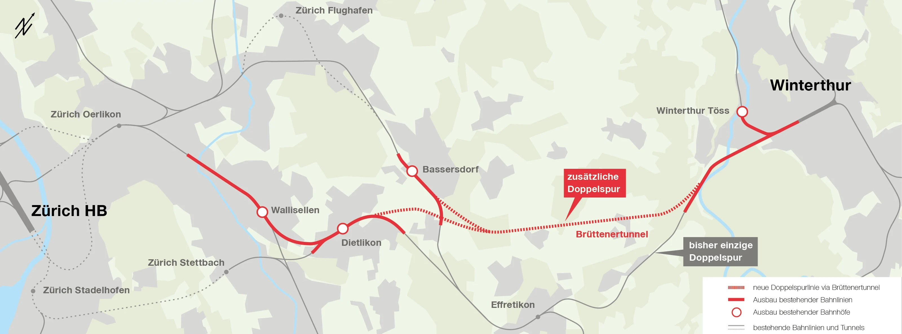

<p align="center">
  
  <br>
  <em>Figure: SBB MehrSpur project layout between Zürich and Winterthur, showing the planned 9 km Brüttenertunnel. Source: <a href="https://news.sbb.ch/de/019d7b77-a0a9-780c-972b-6e31f13102ac/gruenes-licht-fuer-grossprojekt-mehrspur-zuerich-winterthur">SBB News</a>.</em>
</p>

# Infrastructure Planning HS2026 — MehrSpur Exercise

This repository contains the teaching material and coded reference case for ETH's Infrastructure Planning course (HS2026 | [VVZ course description](https://www.vvz.ethz.ch/Vorlesungsverzeichnis/lerneinheit.view?lerneinheitId=206119&semkez=2026W&ansicht=LEHRVERANSTALTUNGEN&lang=de)). The **SBB MehrSpur Zürich–Winterthur** project is used to demonstrate how a complex infrastructure project can be modelled, tested under uncertainty, developed into adaptive pathways, and appraised over a long planning horizon.

### The Case Study at a Glance
The railway corridor between **Zürich HB** and **Winterthur** is one of the most heavily congested passenger transport axes in Switzerland. Currently, rail traffic converges onto a single double-track line via Effretikon, creating a major capacity bottleneck.

Throughout this course, you will model, test, and appraise three progressive infrastructure stages:
- **Stage 0 (Baseline / Status Quo):** The existing network layout relying on the shared Effretikon bottleneck.
- **Stage 1 (Interim Interventions / Station Upgrades):** Local capacity and station enhancements (e.g. Dietlikon, Bassersdorf, Wallisellen) and mobility hub integration to optimize existing tracks.
- **Stage 2 (Full Expansion / Brüttenertunnel):** Construction of the new 9 km underground double-track Brüttenertunnel, providing a direct bypass and unlocking quarter-hourly (15-minute) express rail service across the corridor.

The material is organised into five phases. For every phase, the corresponding **exercise sheet in `docs/` is the primary source for tasks, expected outputs, and submission requirements**. The notebooks provide examples and a coded workflow that you can use as a reference for your own group project.

> **Release schedule:** Course documents and exercise sheets will be released phase by phase during the semester. Pull the latest version of the repository when a new phase begins. Material for a later phase may be missing, incomplete, or subject to change until that phase is officially released.

---

**Contents**

1. [Getting started with the repository, IDEs, and Python](#getting-started)
2. [Course workflow](#course-workflow)
3. [Repository structure](#repository-structure)
4. [Reporting bugs and getting help](#reporting-bugs-and-getting-help)

---

<a id="getting-started"></a>
## Getting started with the repository, IDEs, and Python

Already comfortable with Python, Git, and Jupyter? Skip the installation guide and go directly to the [course workflow](#course-workflow).

<a id="first-time-setup"></a>
<details>
<summary><strong>First-time setup: installation, cloning, and Python environment</strong></summary>

### 1. Install the required software

Install the following before the first exercise:

- [Python 3.11](https://www.python.org/downloads/) (recommended version)
- [Visual Studio Code](https://code.visualstudio.com/) or another Python IDE of your choice
- If you use VS Code, install the **Python** and **Jupyter** extensions
- [Git](https://git-scm.com/downloads/)

### 2. Clone the repository

Open a terminal and run:

```bash
git clone https://github.com/InfrastructurePlanningREISETHZ/IP-HS26-MehrSpur-CaseStudy.git
cd IP-HS26-MehrSpur-CaseStudy
